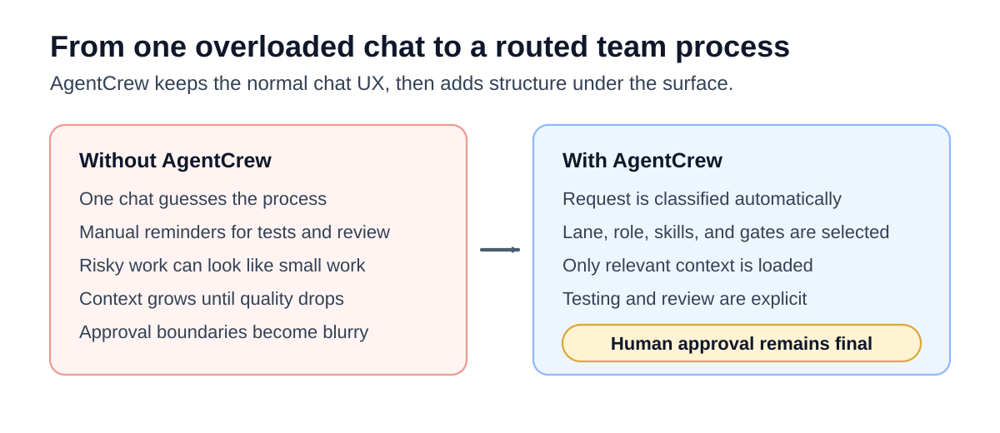

# AgentCrew

**Turn your coding agent into a disciplined software team.**

AgentCrew is a conversation-first, Markdown-first methodology for AI coding agents. Install it once, open any project, and ask normally. AgentCrew routes the request to the right role, applies the right workflow, loads only the needed context, and stops where human approval is required.

It works with host agents such as Codex, Claude Code, Cursor, OpenClaw, Hermes Agent, and similar coding assistants.

## Why AgentCrew

Most coding-agent sessions put too many jobs into one chat: product thinking, planning, implementation, testing, review, documentation, and approval. That creates predictable failures:

- unclear scope;
- giant diffs;
- skipped tests;
- weak review;
- lost context;
- unrelated edits;
- agents acting like they can approve their own work.

AgentCrew gives the agent a team process before it touches the code.

```text
roles define responsibility
playbooks define process
skills define technical guidance
templates define output shape
policies keep human approval final
```

AgentCrew lets agents do the work, testing, review, and preparation, but keeps final product direction, risk acceptance, PR approval, and merging with the human.

## Use It

Clone AgentCrew once outside your projects:

```bash
git clone https://github.com/mlguyYT/AgentCrew.git ~/AgentCrew
~/AgentCrew/bin/agentcrew install
~/AgentCrew/bin/agentcrew doctor
```

Then open any project and enjoy development with your AgentCrew.

Ask for the outcome in plain language:

```text
Fix the login form so empty email shows a validation message.
```

Or start from a product idea:

```text
I want to add team billing to this app. Help me shape it and implement the first safe version.
```

You do not need to say "use AgentCrew", name a role, choose a lane, or run workflow commands during normal use. AgentCrew is loaded by the host agent and should classify the request automatically.

## What You Experience

<p align="center">
  
</p>

For a simple request, AgentCrew can use a lightweight path:

```text
Developer -> Tester -> Human
```

For meaningful risk, it adds review and product checks:

```text
Developer -> Tester -> Reviewer -> Product Manager if needed -> Human
```

For ambiguous, high-impact, security-sensitive, migration-heavy, public API, billing, auth, customer-data, or hard-to-rollback work, it uses a fuller process:

```text
Advisor -> Idea Consultant -> Product Manager -> Developer -> Tester -> Reviewer -> Specialist if needed -> Human
```

AgentCrew can also estimate execution cost before spending meaningful model tokens, then ask for confirmation before the implementation phase.

## What Is Included

```text
AGENTS.md              entry point for host agents
bin/agentcrew          install, doctor, classify, context, engine commands
agent-team/            roles, playbooks, skills, templates, policies, gates
engine/                optional executable layer for orchestration
docs/                  installation, usage, examples, customization
examples/              scenario examples and workflow examples
.github/               optional issue and PR templates
```

AgentCrew lives outside your project repositories. It does not require copying workflow files into every codebase.

Project-specific runtime state, when needed, belongs in the target project:

```text
.agent-state/
```

Each project gets separate state so memory does not mix across projects.

## Optional Engine

AgentCrew works without the engine. The Markdown methodology is the default contract and remains readable, portable, and vendor-neutral.

The included `engine/` is the optional executable layer for teams that want more automation:

- classifier-driven routing;
- structured role execution;
- cost previews before execution;
- project-local run artifacts;
- handoffs, decisions, audits, and summaries;
- provider-neutral model backends.

Install the engine only when you want executable runs:

```bash
cd ~/AgentCrew/engine
python3 -m venv .venv
.venv/bin/pip install -e .
```

Then from any project:

```bash
~/AgentCrew/bin/agentcrew route --task "Fix login validation" --project .
~/AgentCrew/bin/agentcrew run --task "Fix login validation" --project . --backend mock-demo
```

The engine supports local and OpenAI-compatible backends, plus optional provider-specific adapters. No provider is required by the core methodology, and human approval remains final.

## Roles

AgentCrew can route work through focused roles:

- **Advisor** for early reasoning, feasibility, and tradeoffs.
- **Idea Consultant** for turning rough ideas into clearer briefs.
- **Product Manager** for scope, acceptance criteria, and product decisions.
- **Developer** for focused implementation.
- **Tester** for validation and test reporting.
- **Reviewer** for correctness, maintainability, and risk.
- **Security Reviewer** for auth, secrets, data, dependencies, and infrastructure risk.
- **UX / Design Reviewer** for usability, accessibility, responsive behavior, and user-facing flows.
- **Documentation Agent** for docs, examples, changelog, and public API behavior.
- **Release Manager** for release readiness and handoff quality.
- **Skill Validator** for adding or changing reusable skills.

The user can name a role manually, but does not have to. AgentCrew should choose the right starting role from the request.

## Skills And Gates

Skills provide stack-specific and practice-specific guidance. AgentCrew loads them only when relevant, for example:

- Python, TypeScript, JavaScript, Go, Rust, SQL, Shell;
- React, FastAPI, Kubernetes;
- reviewer, product, research, LLM, CNN, documentation, and release practices.

Quality gates are triggered by risk. Examples include security review, dependency and supply-chain checks, integration-test escalation, default-branch merge readiness, shared-memory refresh, and human-only decision logging.

## Safety Model

Agents must not:

- merge pull requests;
- approve as the human;
- bypass branch protection;
- hide failing tests;
- commit secrets;
- silently expand scope;
- make unrelated changes;
- store personal credentials or local machine setup in shared state.

Only the human may approve product direction, accept security or migration risk, approve PRs, merge, deploy, force-push, rewrite shared history, or override required gates.

## Why Markdown-First

AgentCrew is intentionally transparent. Roles, playbooks, policies, templates, skills, and gates are plain files that humans and agents can inspect, edit, review, and version.

The optional engine adds executable orchestration, but the core methodology stays readable and portable.

## Documentation

- [Installation](docs/installation.md)
- [Automatic Loading](docs/auto-load.md)
- [Setup Doctor](docs/doctor.md)
- [Usage Guide](docs/usage.md)
- [Examples](docs/examples.md)
- [Project Presets](docs/project-presets.md)
- [Quality Profiles](docs/quality-profiles.md)
- [Workflow Recipes](docs/workflow-recipes.md)
- [Session Checkpoints](docs/session-checkpoints.md)
- [Security](docs/security.md)
- [Customization](docs/customization.md)
- [FAQ](docs/faq.md)
- [Roadmap](docs/roadmap.md)

## Status

AgentCrew v0.1.0 is usable today as an external methodology package for coding agents. The optional `engine/` is the next evolution of AgentCrew and remains vendor-neutral.

## License

MIT.
